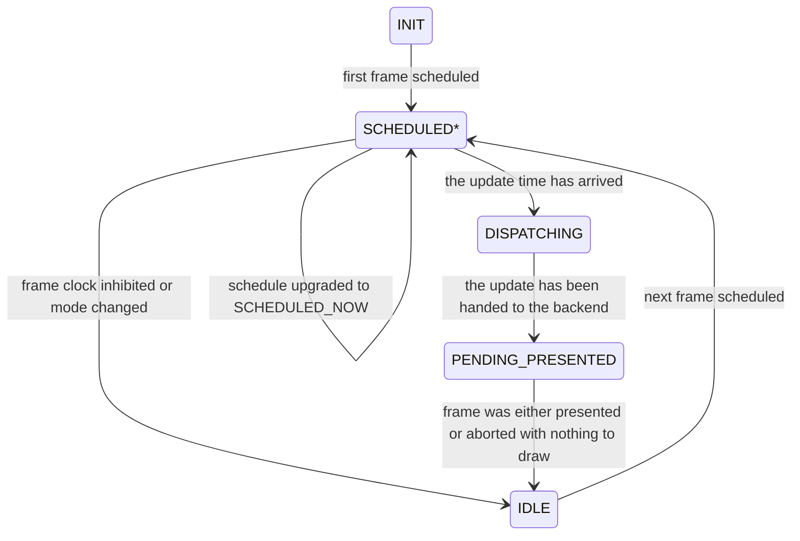

# Clutter Frame scheduling

`ClutterFrameClock` state diagram.

```mermaid
stateDiagram
    INIT --> SCHEDULED* : first frame scheduled
    IDLE --> SCHEDULED* : next frame scheduled
    SCHEDULED* --> IDLE : frame clock inhibited or mode changed
    SCHEDULED* --> SCHEDULED* : schedule upgraded to SCHEDULED_NOW
    SCHEDULED* --> DISPATCHING : the update time has arrived
    DISPATCHING --> PENDING_PRESENTED : the update has been handed to the backend
    PENDING_PRESENTED --> IDLE : frame was either presented or aborted with nothing to draw
```
