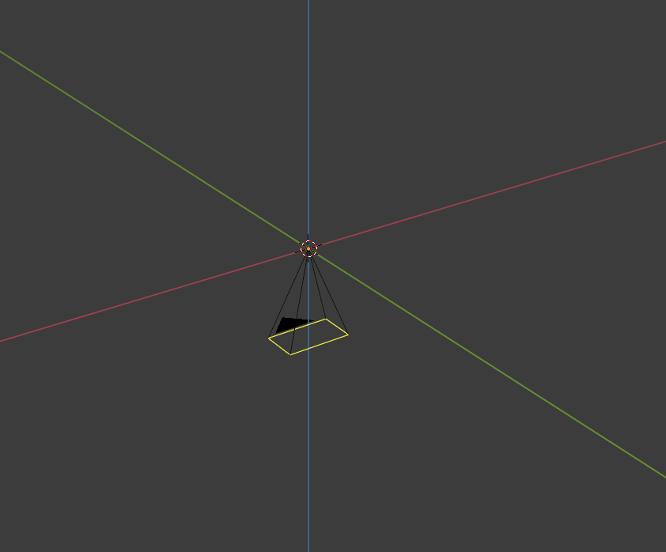
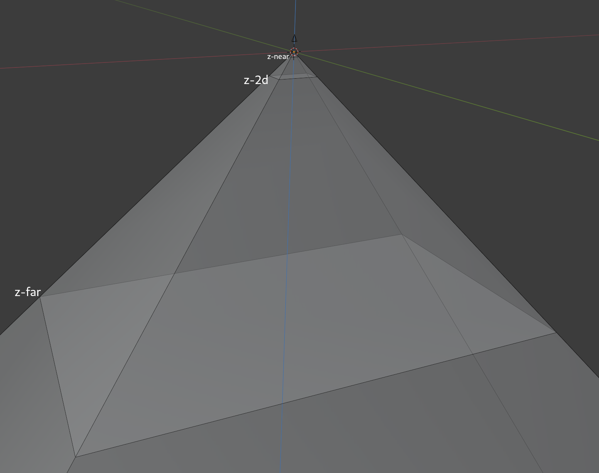
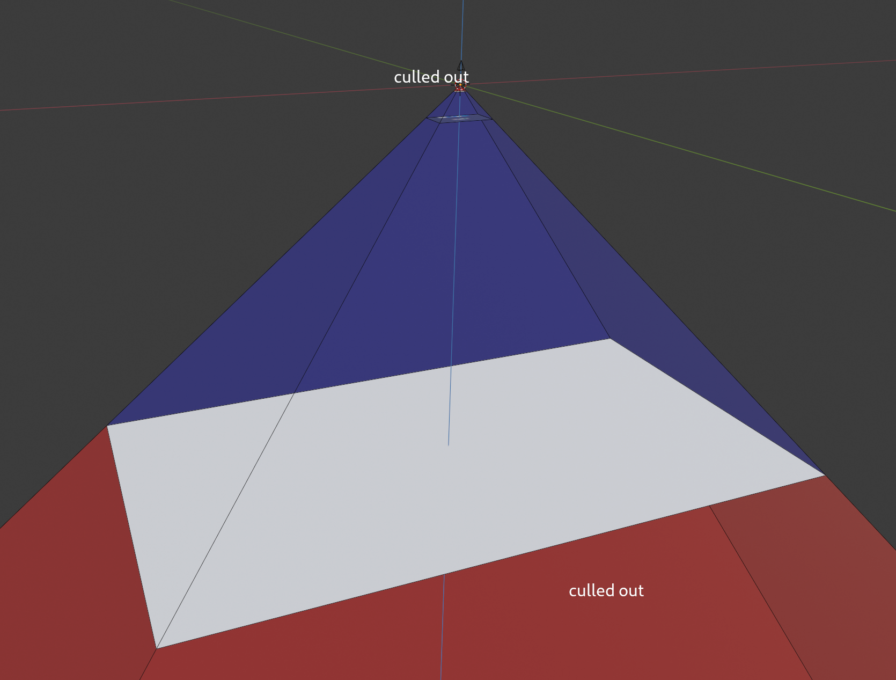
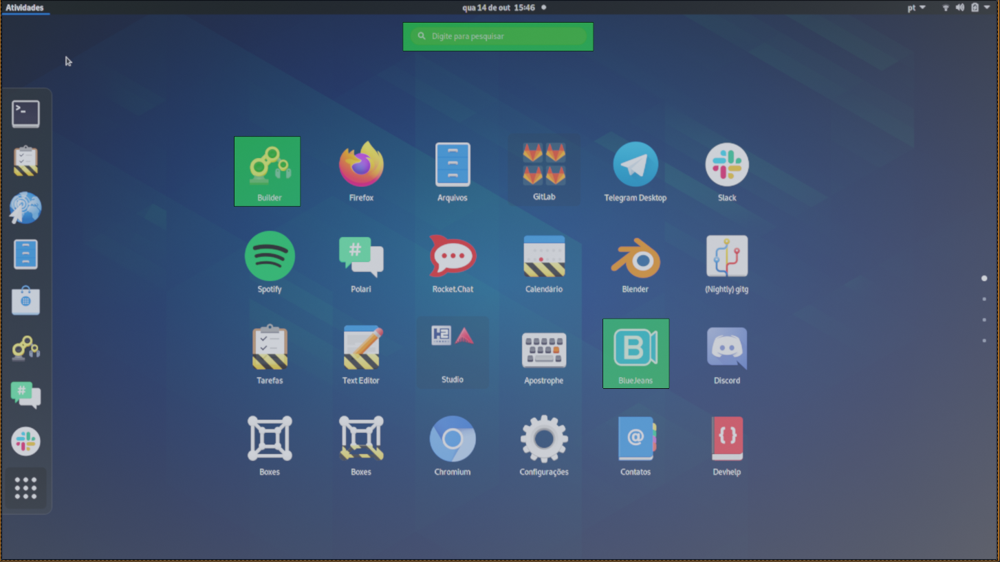
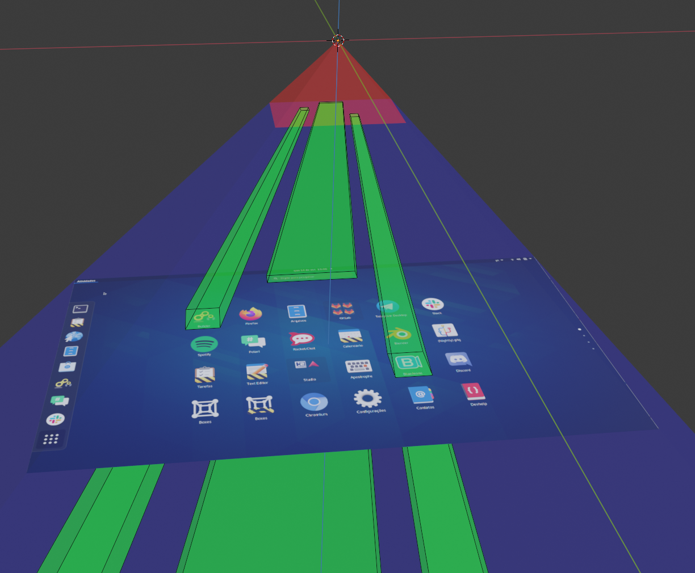

# Clutter Rendering Model

Clutter renders the stage and actors in a 3D space. Most of the time, all the scene is composed of only 2D actors. Remember that common operations, like rotating on the Z axis, and scaling and translating on the X or Y axis, do not make actors 3D, which allows Clutter to optimize rendering for 2D.

## Camera

ClutterStage builds the view matrix (i.e. the matrix that transforms world coordinates into camera coordinates) assuming that the camera is placed at (0, 0, 0) with a normal (0, 0, -1). That means the camera is pointing *down*:

The camera is implicit, and as of now, hardcoded.

## Perspective

When setting up the projection, ClutterStage uses a traditional perspective projection, with the addition of a "2D plane". The 2D plane (`z-2d`) is a plane in the Z axis that all the stage will be rendered into. The perspective projection is build with the following parameters:

 * **field of view Y**: 60º (hardcoded)
 * **aspect**: width / height (depends on monitor configuration)
 * **z-near**: 1.0 (hardcoded)
 * **z-2d**: `z-near + z-near * 49,36` ( = 50,36)
 * **z-far**: `z-2d + z-2d * tan(30°) * 20` ( = 631,97)

## Culling

Figuring out what **not** to draw is an important optimization of the rendering process. Clutter relies on clip frusta to detect which actors it can skip drawing.

### Depth Culling

The z-near and z-far values above are used to build the clip frusta, which culls out actors based on their position. If they're below than z-far, or above z-near, they are not rendered:

### Clip Regions

Clutter supports defining which regions of the 2D screen changed. Suppose you hover a button; only the rectangle that that button cover is redrawn, instead of the entire screen. For example:

*GNOME Shell with 3 clip regions (green)*

 This is translated to the 3D scene by using multiple clip frusta. Each frustum is a slice of the view cone, and only those actors and geometry and intersects it is rendered. If an actor doesn't touch any of the frusta, it is skipped when drawing.

*View cone with 3 clip frusta (green)*
