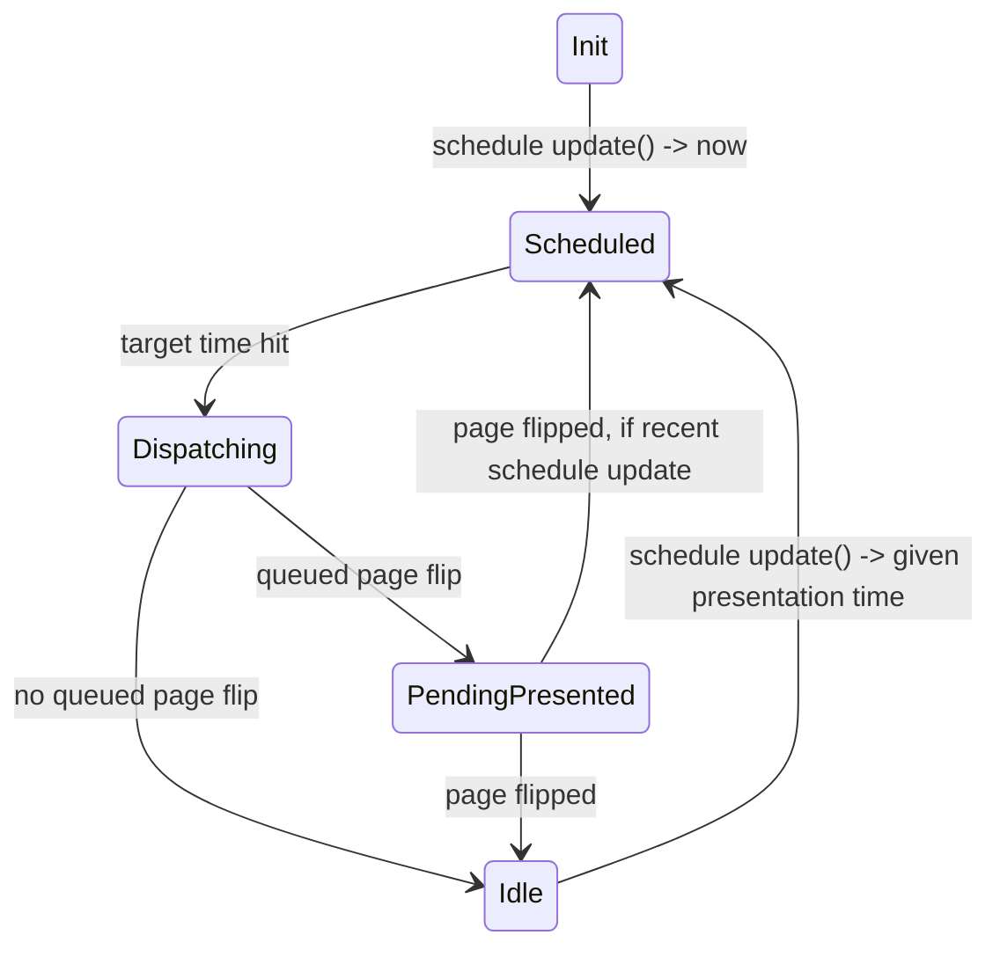

# Frame scheduling

`ClutterFrameClock` state diagram.

```mermaid
stateDiagram
    Init --> Scheduled : schedule update() -> now
    Idle --> Scheduled : schedule update() -> given presentation time
    Scheduled --> Dispatching : target time hit
    Dispatching --> PendingPresented : queued page flip
    Dispatching --> Idle : no queued page flip
    PendingPresented --> Scheduled : page flipped, if recent schedule update
    PendingPresented --> Idle : page flipped
```
