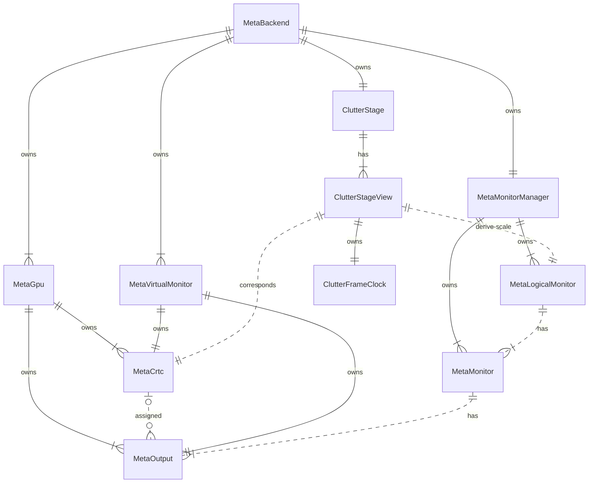
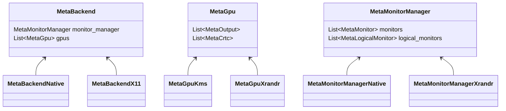
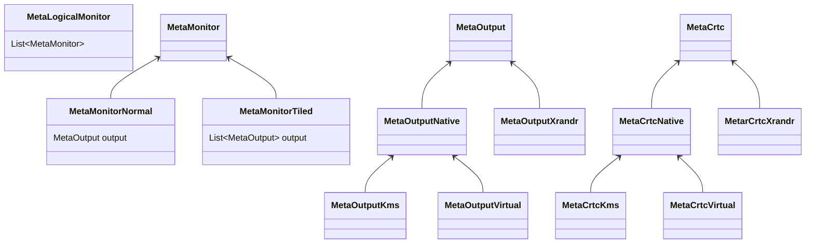
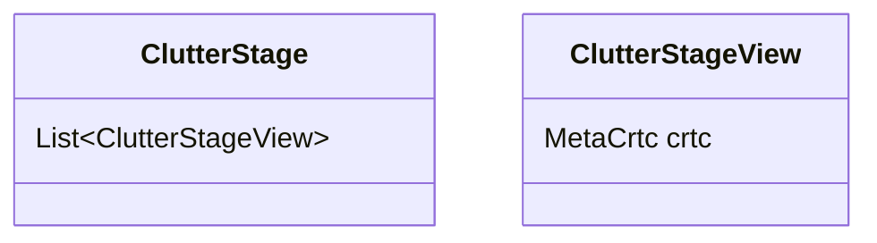
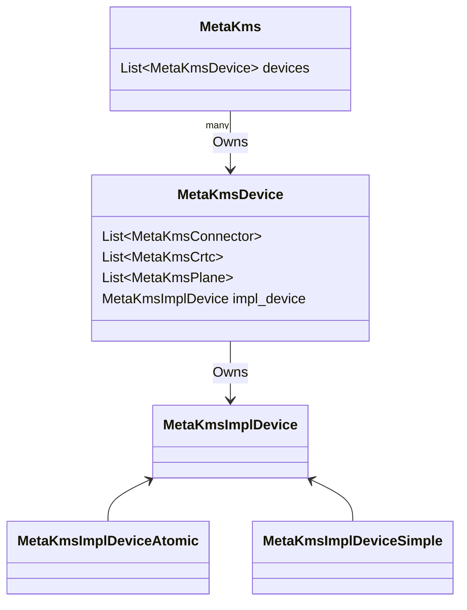
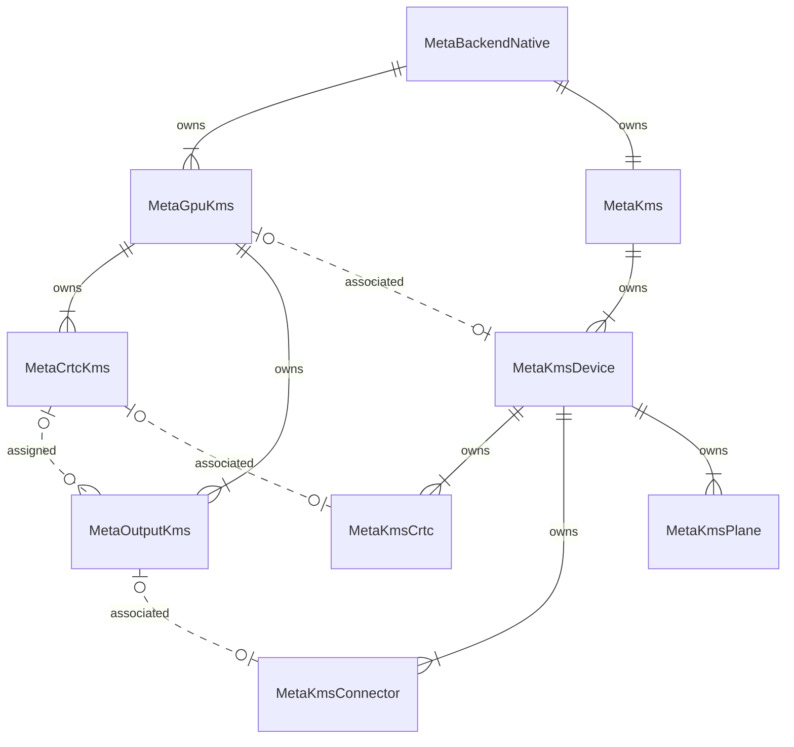

# Compositor stage and hardware relationships

## Brief description of components

 - `MetaLogicalMonitor` is one monitor or more monitor occupying the same region of the compositor space. E.g. when mirroring two monitors, both belong to the same logical monitor.
 - `MetaMonitor` is a single physical monitor, but it can sometimes consist of more than one separate panel (for instance, 5K tiled monitors which literally require 2 cables due to lack of bandwidth)
 - `MetaOuptut` is a connector e.g. a DisplayPort connector or HDMI connector.
 - `MetaCrtc` represents a component on the display hardware that channels video memory to connectors.

## Entity relationship diagram

## Class diagrams

`MetaBackend`, `MetaGpu` and `MetaMonitorManager` class diagrams.

`MetaLogicalMonitor`, `MetaMonitor`, `MetaOutput` and `MetaCrtc` class diagrams.

`ClutterStage` and `ClutterStageView` class diagram when using the Wayland session.

`MetaKms` class diagram.

## Native backend and mode setting

 * `MetaGpuKms`, `MetaCrtcKms` and `MetaOutputKms` are used for configuration.
 * `MetaKmsDevice`, `MetaKmsCrtc`, `MetaKmsConnector` and `MetaKmsPlane` are abstractions on top of kernel mode setting concepts.

